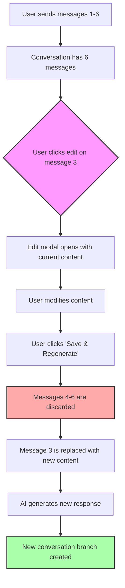
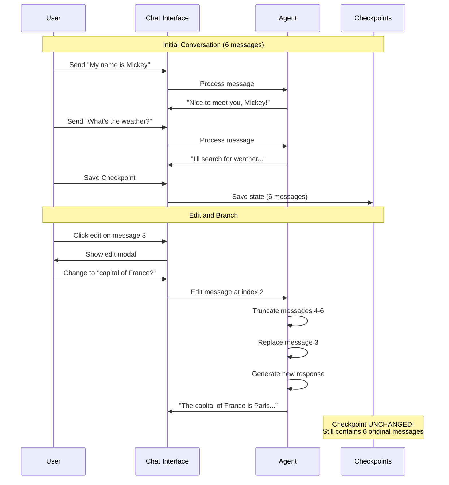
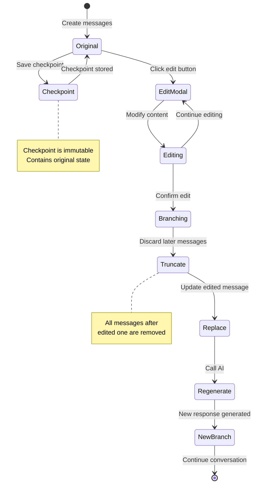
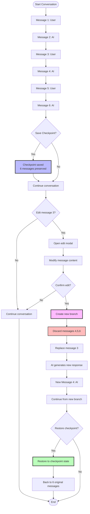

# Message Editing & Branching Documentation

## Overview

The Message Editing feature allows users to modify their previously sent messages, creating new conversation branches. This powerful feature enables exploration of alternative conversation paths while maintaining checkpoint integrity.

## Key Concepts

### 1. Message Editing
- Users can click the edit button (📝) on any of their messages
- Edit the message content in a modal dialog
- All messages after the edited one are automatically discarded
- AI generates a fresh response to the edited message

### 2. Conversation Branching
- Editing creates a new branch from that point
- The conversation continues from the edited message with new AI responses
- Previous branches can be recovered via checkpoints

### 3. Checkpoint Immutability
- **Critical**: Saved checkpoints are never modified by edits
- Checkpoints preserve the original conversation state
- You can always restore to return to the original branch

## Visual Flow Diagram

### Basic Message Editing Flow



## Detailed Example Scenario

### Scenario: Editing Message in 6-Message Conversation

**Initial State:**
```
Message 1 (User): "My name is Mickey"
Message 2 (AI): "Nice to meet you, Mickey!"
Message 3 (User): "What's the weather?"
Message 4 (AI): "I'll search for weather information..."
Message 5 (User): "Thanks!"
Message 6 (AI): "You're welcome!"
```

**User Actions:**
1. User saves checkpoint at this point (6 messages)
2. User clicks edit on Message 3
3. User changes it to: "What's the capital of France?"
4. User clicks "Save & Regenerate"

**Result:**
```
Message 1 (User): "My name is Mickey"
Message 2 (AI): "Nice to meet you, Mickey!"
Message 3 (User): "What's the capital of France?" ← EDITED
Message 4 (AI): "The capital of France is Paris..." ← NEW RESPONSE
```

**Messages 5 and 6 are gone**, but the checkpoint still contains all 6 original messages!



## State Transitions

### Message State Flow



## Implementation Details

### How Edit Works

1. **User Clicks Edit Button**
   - Message index is captured
   - Current message content is loaded into modal
   - Modal displays with edit interface

2. **User Modifies and Confirms**
   - New content is validated (non-empty)
   - Edit data stored for processing

3. **Agent Processes Edit**
   ```python
   def edit_message(message_index, new_content):
       # 1. Get conversation history
       history = get_conversation_history()
       
       # 2. Build new message list up to edited message
       new_messages = messages[0:message_index+1]
       
       # 3. Replace edited message with new content
       new_messages[message_index] = HumanMessage(new_content)
       
       # 4. Update state (truncates everything after)
       current_state["messages"] = new_messages
       
       # 5. Generate new AI response
       response = graph.invoke(current_state)
       
       return response
   ```

4. **Result**
   - Conversation continues from edited point
   - All later messages are gone
   - Checkpoints remain unchanged

### Checkpoint Protection

Checkpoints use deep copying to ensure immutability:

```python
# When saving checkpoint
saved_state = copy.deepcopy(state)
checkpoint = Checkpoint(state=saved_state, ...)

# When editing
# Only current_state is modified
# Checkpoint.state remains unchanged
```

## Architecture Diagram

```mermaid
flowchart TB
    subgraph "User Interface"
        ChatMsg[Chat Messages]
        EditBtn[Edit Button 📝]
        EditModal[Edit Modal]
    end
    
    subgraph "State Management"
        CurrentState[Current State<br/>messages: [1,2,3,4,5,6]]
        Checkpoints[Saved Checkpoints<br/>checkpoint1: [1,2,3,4,5,6]<br/>IMMUTABLE]
    end
    
    subgraph "Agent Processing"
        EditMethod[edit_message method]
        Truncate[Truncate messages]
        Regenerate[AI Generate Response]
    end
    
    EditBtn --> EditModal
    EditModal -->|Confirm edit| EditMethod
    EditMethod --> CurrentState
    EditMethod --> Truncate
    Truncate --> Regenerate
    Regenerate --> CurrentState
    
    CurrentState -.->|Deep copy on save| Checkpoints
    Checkpoints -.->|Restore| CurrentState
    
    style Checkpoints fill:#aaf,stroke:#333,stroke-width:3px
    style CurrentState fill:#faa,stroke:#333,stroke-width:2px
    style EditModal fill:#afa,stroke:#333,stroke-width:2px
```

## Example Use Cases

### 1. Correcting Typos

**Before:**
```
User: "What is Pythn used for?"
AI: "Python (assuming you meant Python) is used for..."
```

**Action:** Edit "Pythn" → "Python"

**After:**
```
User: "What is Python used for?"
AI: "Python is a versatile programming language used for..."
```

### 2. Exploring Alternative Questions

**Branch A (Original):**
```
1. User: "Tell me about dogs"
2. AI: "Dogs are domesticated mammals..."
[Save checkpoint here]
```

**Edit message 1 to create Branch B:**
```
1. User: "Tell me about cats"
2. AI: "Cats are independent felines..."
```

**Restore checkpoint to return to Branch A:**
```
1. User: "Tell me about dogs"
2. AI: "Dogs are domesticated mammals..."
```

### 3. Refining Complex Questions

**Original:**
```
User: "How do I code?"
AI: "Coding involves writing instructions..."
```

**Edit to be more specific:**
```
User: "How do I implement a binary search tree in Python?"
AI: "Here's how to implement a BST in Python: class Node:..."
```

## Comparison with Checkpoint Restore

| Feature | Message Editing | Checkpoint Restore |
|---------|----------------|-------------------|
| **Scope** | Edits one message | Restores entire state |
| **Discards** | Messages after edited one | Messages after checkpoint |
| **AI Response** | Always generates new response | No new response |
| **Use Case** | Refine a question | Return to conversation point |
| **Checkpoints** | Preserved unchanged | Used as restore source |
| **Branch Creation** | Creates new branch | Switches to existing branch |

## Technical Flow Chart

### Complete Edit-Branch-Checkpoint Cycle



## Best Practices

### ✅ Do's

1. **Save Checkpoints Before Major Edits**
   - If you want to preserve the current branch
   - Save a checkpoint before editing
   - You can always return to it

2. **Use Descriptive Checkpoint Names**
   - "Before exploring alternatives"
   - "Original conversation about Python"
   - Helps you identify which branch to restore

3. **Edit for Refinement**
   - Clarify vague questions
   - Fix typos or grammar
   - Add more specific context

4. **Experiment Freely**
   - Checkpoints protect your work
   - Try different approaches
   - Restore if you don't like the new branch

### ❌ Don'ts

1. **Don't Assume Edits Affect Checkpoints**
   - Checkpoints are immutable
   - Edits only affect current conversation
   - Must explicitly save new checkpoint if desired

2. **Don't Edit Without Saving Important States**
   - If current conversation is valuable
   - Save checkpoint first
   - Then edit freely

3. **Don't Edit AI Messages**
   - Only user messages can be edited
   - This maintains conversation integrity
   - AI messages are responses to user input

## FAQ

**Q: What happens to checkpoints when I edit a message?**

A: Nothing. Checkpoints are completely unchanged. They preserve the exact conversation state when they were created.

**Q: Can I edit a message that's before a checkpoint?**

A: Yes. The edit will affect your current conversation, but the checkpoint still contains the original message.

**Q: If I edit message 3 in a 6-message conversation, what happens to messages 4-6?**

A: They are permanently discarded from the current conversation. However, if you saved a checkpoint with those messages, you can restore to get them back.

**Q: Can I undo an edit?**

A: Not directly, but if you saved a checkpoint before editing, you can restore to that checkpoint to return to the original state.

**Q: Can I edit AI responses?**

A: No, only user messages can be edited. This maintains the integrity of the conversation flow (user asks, AI responds).

**Q: What happens if the AI judge creates a checkpoint after my edit?**

A: The AI judge evaluates the new conversation state after your edit. If significant, it may create a new checkpoint with the edited branch.

## Summary

Message Editing provides powerful conversation branching while maintaining the safety net of immutable checkpoints. This combination allows for fearless exploration of different conversation paths with the confidence that you can always return to previous states.

Key Takeaways:
- ✏️ Edit any user message to create a new branch
- 🗑️ Later messages are automatically discarded
- 🔒 Checkpoints remain completely unchanged
- 🔄 Restore checkpoints to return to previous branches
- 🌳 Build complex conversation trees with multiple branches
