# Message Editing & Branching Documentation

## Overview

The Message Editing feature allows users to modify their previously sent messages, creating new conversation branches. This powerful feature includes **version history tracking** - every edit is preserved, and you can navigate between versions using arrow buttons.

## Key Concepts

### 1. Message Editing
- Users can click the edit button (📝) on any of their messages
- Edit the message content in a modal dialog
- Message updates immediately in the UI when "Save & Regenerate" is clicked
- Send button turns grey during AI processing
- All messages after the edited one are automatically discarded
- AI generates a fresh response to the edited message

### 2. Version History
- **Every edit creates a new version** of the message
- Original message is preserved as version 1
- Each subsequent edit becomes version 2, 3, etc.
- Navigation arrows (◀ ▶) appear next to messages with multiple versions
- Click arrows to switch between versions
- Version indicator shows current/total (e.g., "2/3")
- **Switching versions restores both the user message AND the corresponding AI response**
- Each version includes the full conversation state at that point
- No regeneration needed - instant state restoration

### 3. Conversation Branching
- Editing creates a new branch from that point
- The conversation continues from the edited message with new AI responses
- Previous branches can be recovered via checkpoints or version history

### 4. Checkpoint Immutability
- **Critical**: Saved checkpoints are never modified by edits
- Checkpoints preserve the original conversation state
- You can always restore to return to the original branch

## Visual Flow Diagram

### Basic Message Editing Flow with Version History

```mermaid
flowchart TD
    A[User sends messages 1-6] --> B[Conversation has 6 messages]
    B --> C{User clicks edit on message 3}
    C --> D[Edit modal opens with current content]
    D --> E[User modifies content]
    E --> F[User clicks 'Save & Regenerate']
    F --> G[UI updates immediately]
    G --> H[Send button turns grey]
    H --> I[Original content saved as v1]
    I --> J[New content becomes v2]
    J --> K[Messages 4-6 are discarded]
    K --> L[Message 3 is replaced with v2]
    L --> M[AI generates new response]
    M --> N[Navigation arrows appear: ◀ v2/2 ▶]
    N --> O{User clicks ◀ arrow?}
    O -->|Yes| P[Switch to v1 instantly]
    O -->|No| Q[Continue with v2]
    P --> R[Can click ▶ to return to v2]
    
    style C fill:#f9f,stroke:#333,stroke-width:2px
    style G fill:#9f9,stroke:#333,stroke-width:2px
    style I fill:#ff9,stroke:#333,stroke-width:2px
    style N fill:#9ff,stroke:#333,stroke-width:2px
    style K fill:#faa,stroke:#333,stroke-width:2px
```



## Detailed Example Scenario

### Scenario: Editing Message Multiple Times with Version History

**Initial State:**
```
Message 1 (User): "My name is Mickey"
Message 2 (AI): "Nice to meet you, Mickey!"
Message 3 (User): "What's the weather?" [v1]
Message 4 (AI): "I'll search for weather information..."
Message 5 (User): "Thanks!"
Message 6 (AI): "You're welcome!"
```

**First Edit - User Actions:**
1. User saves checkpoint at this point (6 messages)
2. User clicks edit on Message 3
3. User changes it to: "What's the capital of France?"
4. User clicks "Save & Regenerate"

**Result After First Edit:**
```
Message 1 (User): "My name is Mickey"
Message 2 (AI): "Nice to meet you, Mickey!"
Message 3 (User): "What's the capital of France?" ◀ 2/2 ▶ [EDITED]
Message 4 (AI): "The capital of France is Paris..." [NEW RESPONSE]
```

Version history for Message 3:
- Version 1: "What's the weather?" + AI: "I'll search for weather..."
- Version 2: "What's the capital of France?" + AI: "The capital of France is Paris..." ← current

**Second Edit - User Actions:**
1. User clicks edit on Message 3 again
2. User changes it to: "Tell me about Python"
3. User clicks "Save & Regenerate"

**Result After Second Edit:**
```
Message 1 (User): "My name is Mickey"
Message 2 (AI): "Nice to meet you, Mickey!"
Message 3 (User): "Tell me about Python" ◀ 3/3 ▶ [EDITED AGAIN]
Message 4 (AI): "Python is a versatile programming language..." [NEW RESPONSE]
```

Version history for Message 3:
- Version 1: "What's the weather?" + AI: "I'll search for weather..."
- Version 2: "What's the capital of France?" + AI: "The capital of France is Paris..."
- Version 3: "Tell me about Python" + AI: "Python is a versatile..." ← current

**Navigation:**
- Click ◀ (left arrow): Shows version 2 with its AI response
- Click ◀ again: Shows version 1 with its AI response
- Click ▶ (right arrow): Moves forward through versions
- **Important**: When you switch versions, BOTH the user message AND the AI response change
- Each version is a complete snapshot of the conversation at that point

**Messages 5 and 6 from original are gone**, but the checkpoint still contains all 6 original messages!

```mermaid
sequenceDiagram
    participant U as User
    participant UI as Chat Interface
    participant A as Agent
    participant VH as Version History
    participant CP as Checkpoints
    
    Note over U,CP: Initial Conversation (6 messages)
    U->>UI: Send "My name is Mickey"
    UI->>A: Process message
    A->>UI: "Nice to meet you, Mickey!"
    U->>UI: Send "What's the weather?"
    UI->>A: Process message
    A->>UI: "I'll search for weather..."
    U->>UI: Save Checkpoint
    UI->>CP: Save state (6 messages)
    
    Note over U,CP: First Edit
    U->>UI: Click edit on message 3
    UI->>U: Show edit modal
    U->>UI: Change to "capital of France?"
    U->>UI: Click Save & Regenerate
    UI->>UI: Update display immediately
    UI->>VH: Store v1: "What's the weather?"
    VH->>VH: Add v2: "capital of France?"
    UI->>A: Edit message at index 2
    A->>A: Truncate messages 4-6
    A->>A: Replace message 3
    A->>A: Generate new response
    A->>UI: "The capital of France is Paris..."
    UI->>UI: Show arrows: ◀ v2/2 ▶
    
    Note over U,CP: Version Navigation
    U->>UI: Click ◀ arrow
    UI->>VH: Get v1
    VH->>UI: "What's the weather?"
    UI->>UI: Update display (no API call)
    U->>UI: Click ▶ arrow
    UI->>VH: Get v2
    VH->>UI: "capital of France?"
    UI->>UI: Update display
    
    Note over U,CP: Second Edit
    U->>UI: Edit again to "Tell me about Python"
    VH->>VH: Add v3: "Tell me about Python"
    A->>UI: New response
    UI->>UI: Show arrows: ◀ v3/3 ▶
    
    Note over CP: Checkpoint UNCHANGED!<br/>Still contains 6 original messages
```



## State Transitions

### Message State Flow with Version History


## Implementation Details

### How Edit Works

1. **User Clicks Edit Button**
   - Message index is captured
   - Current message content is loaded into modal
   - Modal displays with edit interface

2. **User Modifies and Confirms**
   - New content is validated (non-empty)
   - Edit data stored for processing

3. **Agent Processes Edit**
   ```python
   def edit_message(message_index, new_content):
       # 1. Get conversation history
       history = get_conversation_history()
       
       # 2. Build new message list up to edited message
       new_messages = messages[0:message_index+1]
       
       # 3. Replace edited message with new content
       new_messages[message_index] = HumanMessage(new_content)
       
       # 4. Update state (truncates everything after)
       current_state["messages"] = new_messages
       
       # 5. Generate new AI response
       response = graph.invoke(current_state)
       
       return response
   ```

4. **Result**
   - Conversation continues from edited point
   - All later messages are gone
   - Checkpoints remain unchanged

### Checkpoint Protection

Checkpoints use deep copying to ensure immutability:

```python
# When saving checkpoint
saved_state = copy.deepcopy(state)
checkpoint = Checkpoint(state=saved_state, ...)

# When editing
# Only current_state is modified
# Checkpoint.state remains unchanged
```

## Architecture Diagram

```mermaid
flowchart TB
    subgraph "User Interface"
        ChatMsg[Chat Messages]
        EditBtn[Edit Button 📝]
        EditModal[Edit Modal]
    end
    
    subgraph "State Management"
        CurrentState[Current State<br/>messages: [1,2,3,4,5,6]]
        Checkpoints[Saved Checkpoints<br/>checkpoint1: [1,2,3,4,5,6]<br/>IMMUTABLE]
    end
    
    subgraph "Agent Processing"
        EditMethod[edit_message method]
        Truncate[Truncate messages]
        Regenerate[AI Generate Response]
    end
    
    EditBtn --> EditModal
    EditModal -->|Confirm edit| EditMethod
    EditMethod --> CurrentState
    EditMethod --> Truncate
    Truncate --> Regenerate
    Regenerate --> CurrentState
    
    CurrentState -.->|Deep copy on save| Checkpoints
    Checkpoints -.->|Restore| CurrentState
    
    style Checkpoints fill:#aaf,stroke:#333,stroke-width:3px
    style CurrentState fill:#faa,stroke:#333,stroke-width:2px
    style EditModal fill:#afa,stroke:#333,stroke-width:2px
```

## Example Use Cases

### 1. Correcting Typos with History

**Before:**
```
User: "What is Pythn used for?" [v1]
AI: "Python (assuming you meant Python) is used for..."
```

**Action:** Edit "Pythn" → "Python"

**After:**
```
User: "What is Python used for?" ◀ v2/2 ▶
AI: "Python is a versatile programming language used for..."
```

**Navigation:** Click ◀ to see original typo if needed

### 2. Exploring Alternative Questions with Version Tracking

**Branch A (Original):**
```
1. User: "Tell me about dogs" [v1]
2. AI: "Dogs are domesticated mammals..."
[Save checkpoint here]
```

**Edit to create Branch B:**
```
1. User: "Tell me about cats" ◀ v2/2 ▶
2. AI: "Cats are independent felines..."
```

**Edit again to create Branch C:**
```
1. User: "Tell me about birds" ◀ v3/3 ▶
2. AI: "Birds are feathered vertebrates..."
```

**Navigation Options:**
- Click ◀ twice to see v1 "Tell me about dogs"
- Click ◀ once to see v2 "Tell me about cats"  
- Click ▶ to move forward through versions
- All versions accessible without regenerating

**Restore checkpoint to return to Branch A:**
```
1. User: "Tell me about dogs"
2. AI: "Dogs are domesticated mammals..."
```

### 3. Refining Questions Iteratively

**Version 1 (Vague):**
```
User: "How do I code?" [v1]
AI: "Coding involves writing instructions..."
```

**Version 2 (More Specific):**
```
User: "How do I code in Python?" ◀ v2/3 ▶
AI: "Here's how to start with Python..."
```

**Version 3 (Very Specific):**
```
User: "How do I implement a binary search tree in Python?" ◀ v3/3 ▶
AI: "Here's how to implement a BST in Python: class Node:..."
```

**Benefit:** Can review how different levels of specificity affected AI responses by navigating versions

## Comparison with Checkpoint Restore

| Feature | Message Editing | Version Navigation | Checkpoint Restore |
|---------|----------------|-------------------|-------------------|
| **Scope** | Edits one message | Views different versions of one message | Restores entire state |
| **Discards** | Messages after edited one | Nothing | Messages after checkpoint |
| **AI Response** | Always generates new response | No new response | No new response |
| **Speed** | Slow (API call) | Instant (UI only) | Fast (state restore) |
| **History** | Creates new version | Switches between versions | Returns to saved state |
| **Use Case** | Try new question | Compare edit versions | Return to conversation point |
| **Checkpoints** | Preserved unchanged | Preserved unchanged | Used as restore source |
| **Branch Creation** | Creates new branch | No branch change | Switches to existing branch |
| **UI Indicator** | ◀ vX/Y ▶ arrows appear | Arrow buttons update | Checkpoint list |

## Technical Flow Chart

### Complete Edit-Branch-Checkpoint Cycle


## Best Practices

### ✅ Do's

1. **Use Version Navigation to Compare**
   - After editing, use arrows to compare versions
   - See how different phrasings affect understanding
   - No API cost to switch versions

2. **Save Checkpoints Before Major Edits**
   - If you want to preserve the current branch
   - Save a checkpoint before editing
   - You can always return to it

3. **Use Descriptive Checkpoint Names**
   - "Before exploring alternatives"
   - "Original conversation about Python"
   - Helps you identify which branch to restore

4. **Edit for Refinement**
   - Clarify vague questions
   - Fix typos or grammar
   - Add more specific context
   - Build up from general to specific (v1 → v2 → v3)

5. **Experiment Freely**
   - Checkpoints protect your work
   - Version history preserves all edits
   - Try different approaches
   - Navigate back to any version instantly

6. **Review Version History**
   - Use arrows to see how your question evolved
   - Learn what made questions clearer
   - Understand which versions worked best

### ❌ Don'ts

1. **Don't Assume Edits Affect Checkpoints**
   - Checkpoints are immutable
   - Edits only affect current conversation
   - Must explicitly save new checkpoint if desired

2. **Don't Edit Without Saving Important States**
   - If current conversation is valuable
   - Save checkpoint first
   - Then edit freely

3. **Don't Edit AI Messages**
   - Only user messages can be edited
   - This maintains conversation integrity
   - AI messages are responses to user input

4. **Don't Forget Version History Exists**
   - After multiple edits, remember earlier versions are preserved
   - You can always navigate back
   - No need to manually copy/save old text

5. **Don't Confuse Version Navigation with Regeneration**
   - Switching versions = instant UI update only
   - To regenerate from different version, switch first then edit
   - Version navigation doesn't create new AI responses

## FAQ

**Q: What happens to checkpoints when I edit a message?**

A: Nothing. Checkpoints are completely unchanged. They preserve the exact conversation state when they were created.

**Q: Can I edit a message that's before a checkpoint?**

A: Yes. The edit will affect your current conversation, but the checkpoint still contains the original message.

**Q: If I edit message 3 in a 6-message conversation, what happens to messages 4-6?**

A: They are permanently discarded from the current conversation. However, if you saved a checkpoint with those messages, you can restore to get them back.

**Q: How many versions are stored for each edited message?**

A: All versions are stored! v1 is the original, and each subsequent edit becomes v2, v3, v4, etc. There's no limit.

**Q: Does switching between versions with the arrows trigger AI regeneration?**

A: No! Version navigation is instant and only updates the UI. It doesn't make any API calls or regenerate responses. This makes it very fast and free to compare versions.

**Q: Can I undo an edit?**

A: Yes! Click the ◀ arrow to go back to version 1 (original). If you want to regenerate AI response from v1, switch to it and then click edit → save & regenerate.

**Q: Can I edit AI responses?**

A: No, only user messages can be edited. This maintains the integrity of the conversation flow (user asks, AI responds).

**Q: What happens if the AI judge creates a checkpoint after my edit?**

A: The AI judge evaluates the new conversation state after your edit. If significant, it may create a new checkpoint with the edited branch. Your version history remains intact.

**Q: If I edit a message multiple times and then restore a checkpoint, do I lose the version history?**

A: Yes, restoring a checkpoint replaces your entire current state, including version history. The checkpoint contains its own state from when it was created.

**Q: Can I see all versions at once?**

A: Not currently - you navigate one at a time using arrows. The version indicator (v2/5) shows which version you're viewing and how many total versions exist.

**Q: What's the difference between version navigation and checkpoint restore?**

A: Version navigation switches the display of ONE message between its different edits (instant, UI only). Checkpoint restore replaces the ENTIRE conversation with a saved state (includes all messages, slower).

## Summary

Message Editing provides powerful conversation branching with complete version history tracking while maintaining the safety net of immutable checkpoints. This combination allows for fearless exploration of different conversation paths with instant access to all previous versions.

Key Takeaways:
- ✏️ Edit any user message to create a new branch
- 📚 All versions are preserved (version 1, 2, 3, ...)
- ◀▶ Navigate between versions instantly with arrow buttons
- 🗑️ Later messages are automatically discarded when editing
- ⚡ Version switching is instant - restores full conversation state
- 🤖 AI responses change when you switch versions
- 🔒 Checkpoints remain completely unchanged
- 🔄 Restore checkpoints to return to previous branches
- 🌳 Build complex conversation trees with multiple branches
- 📊 Compare different phrasings and their AI responses
- 💡 UI updates immediately when editing - send button turns grey during processing
