# Time Travel (Checkpoint) System - Technical Documentation

This document provides a detailed explanation of how the checkpoint-based time travel system works in this application.

## Overview

The time travel feature allows users to save conversation states at any point and restore to previous states, effectively "traveling back in time" in the conversation. When restoring to a checkpoint, all messages and checkpoints created after that point are permanently discarded.

## Core Concepts

### What is a Checkpoint?

A checkpoint is a snapshot of the conversation state at a specific moment in time. It contains:

- **ID**: Unique identifier for the checkpoint
- **Name**: User-friendly name (auto-generated or custom)
- **Timestamp**: When the checkpoint was created
- **State**: Complete conversation history (all messages)
- **Message Count**: Number of messages at this point
- **Description**: Optional description of the checkpoint

### State Structure

```python
AgentState = {
    "messages": [
        SystemMessage(content="..."),
        HumanMessage(content="User's first question"),
        AIMessage(content="AI's first response"),
        HumanMessage(content="User's second question"),
        AIMessage(content="AI's second response"),
        ...
    ]
}
```

## Time Travel Mechanism

### Linear Timeline Model

The checkpoint system uses a **linear timeline model** where:

1. Checkpoints are stored in chronological order
2. Restoring to a checkpoint "rewinds" time
3. All future events after the restored checkpoint are erased


### Checkpoint State Diagram


### Restore Operation Visualization


## Detailed Flow Diagrams

### 1. Save Checkpoint Flow

```mermaid
flowchart TD
    A[👆 User clicks Save] --> B[Get current AgentState]
    B --> C[Deep copy the state<br/>to prevent mutation]
    C --> D[Generate metadata]
    D --> D1[Unique ID]
    D --> D2[Timestamp]
    D --> D3[Message count]
    D1 & D2 & D3 --> E[Create Checkpoint object]
    E --> F[Append ID to<br/>checkpoint_order list]
    F --> G[Store in checkpoints<br/>dictionary]
    G --> H[✅ Done]
    
    style A fill:#e1f5fe
    style H fill:#c8e6c9
```



### 2. Restore Checkpoint Flow

```mermaid
flowchart TD
    A[👆 User clicks Restore on CP2] --> B{Show confirmation<br/>dialog}
    B -->|Cancel| C[❌ Cancelled]
    B -->|Confirm| D[Find checkpoint index<br/>in order list]
    D --> E[Get all checkpoints<br/>after this index]
    E --> F[DELETE all future<br/>checkpoints from storage]
    F --> G[Truncate order list<br/>to index + 1]
    G --> H[Deep copy saved state]
    H --> I[Reconstruct messages<br/>from serialized data]
    I --> J[Set as current<br/>AgentState]
    J --> K[✅ Time has rewound!]
    
    style A fill:#e1f5fe
    style C fill:#ffcdd2
    style F fill:#ffcdd2
    style K fill:#c8e6c9
```



### 3. Message Serialization/Deserialization

```mermaid
flowchart LR
    subgraph Saving["Saving (Serialize)"]
        direction TB
        LM1[HumanMessage<br/>content='Hello'] --> S1["{<br/>type: 'HumanMessage'<br/>content: 'Hello'<br/>}"]
        LM2[AIMessage<br/>content='Hi!'<br/>tool_calls=[...]] --> S2["{<br/>type: 'AIMessage'<br/>content: 'Hi!'<br/>tool_calls: [...]<br/>}"]
    end
    
    subgraph Restoring["Restoring (Deserialize)"]
        direction TB
        D1["{<br/>type: 'HumanMessage'<br/>content: 'Hello'<br/>}"] --> RM1[HumanMessage<br/>content='Hello']
        D2["{<br/>type: 'AIMessage'<br/>content: 'Hi!'<br/>}"] --> RM2[AIMessage<br/>content='Hi!']
    end
    
    Saving -->|Store in<br/>Checkpoint| Restoring
```

## Data Structures

### CheckpointManager Class Diagram


### Storage Structure

```mermaid
flowchart TB
    subgraph CheckpointManager
        order["checkpoint_order<br/>['cp1', 'cp2', 'cp3']"]
        
        subgraph checkpoints["checkpoints (Dict)"]
            cp1["'cp1' → Checkpoint {<br/>id: 'cp1'<br/>name: 'Checkpoint 1'<br/>timestamp: '10:00:00'<br/>message_count: 2<br/>state: {...}<br/>}"]
            cp2["'cp2' → Checkpoint {<br/>id: 'cp2'<br/>name: 'Checkpoint 2'<br/>timestamp: '10:05:00'<br/>message_count: 4<br/>state: {...}<br/>}"]
            cp3["'cp3' → Checkpoint {<br/>id: 'cp3'<br/>name: 'Checkpoint 3'<br/>timestamp: '10:10:00'<br/>message_count: 6<br/>state: {...}<br/>}"]
        end
        
        order --> cp1
        order --> cp2
        order --> cp3
    end
```



## Complete Example Scenario

### Scenario: User conversation with time travel


### Timeline Visualization

```mermaid
gitgraph
    commit id: "Start"
    commit id: "User: Weather?"
    commit id: "AI: Sunny 72°F"
    branch checkpoint1
    commit id: "CP1 Saved" type: HIGHLIGHT
    checkout main
    commit id: "User: Tomorrow?"
    commit id: "AI: Cloudy 65°F"
    branch checkpoint2
    commit id: "CP2 Saved" type: HIGHLIGHT
    checkout main
    commit id: "User: Stocks?"
    commit id: "AI: Which stocks?"
    commit id: "User: AAPL"
    commit id: "AI: $195..." type: REVERSE
    branch checkpoint3
    commit id: "CP3 Saved" type: REVERSE
    checkout checkpoint2
    commit id: "RESTORE HERE" type: HIGHLIGHT
    commit id: "User: Weekend?"
    commit id: "AI: Great weather!"
```

## System Architecture


## Best Practices

### When to Save Checkpoints


## Technical Considerations

### Performance Complexity


| Operation | Time Complexity | Notes |
|-----------|-----------------|-------|
| Save checkpoint | O(n) | n = number of messages (deep copy) |
| Restore | O(m + n) | m = checkpoints to delete, n = messages |
| List checkpoints | O(k) | k = number of checkpoints |
| Delete checkpoint | O(1) | Dictionary lookup + removal |

### Memory Usage


## Troubleshooting


---

## Summary


The time travel system provides a powerful way to explore different conversation paths without losing your progress. Use checkpoints strategically to maximize the benefit of this feature!
