# Time Travel (Checkpoint) System - Complete Technical Documentation

This document provides a comprehensive explanation of the AI-powered checkpoint-based time travel system, including architecture, workflows, and the AI judge agent that automatically creates checkpoints.

## Table of Contents

1. [Overview](#overview)
2. [Core Concepts](#core-concepts)
3. [AI-Powered Checkpoint System](#ai-powered-checkpoint-system)
4. [System Architecture](#system-architecture)
5. [LangGraph Workflow](#langgraph-workflow)
6. [Component Details](#component-details)
7. [Data Structures](#data-structures)
8. [UI Features](#ui-features)
9. [Complete Examples](#complete-examples)
10. [Best Practices](#best-practices)
11. [Troubleshooting](#troubleshooting)

## Overview

The time travel feature combines manual and AI-powered checkpoint creation:

- **Manual Checkpoints**: Users can save conversation states at any point
- **AI Auto-Checkpoints**: AI judge automatically evaluates and saves significant conversation moments
- **Visual Distinction**: Different colors and icons distinguish AI vs human checkpoints (🤖 vs 👤)
- **Smart Save Button**: Automatically disabled when AI has already saved the current state
- **Time Travel**: Restore to any checkpoint, discarding all future states

### Key Features

```mermaid
mindmap
  root((Time Travel<br/>System))
    Manual Checkpoints
      User-initiated saves
      Custom names
      Optional descriptions
      👤 Green badge
    AI Checkpoints
      Automatic evaluation
      AI-suggested names
      Reasoning provided
      🤖 Blue badge
    Time Travel
      Restore to any point
      Destructive operation
      Discards future states
    Smart UI
      Context-aware buttons
      Tooltips
      Color coding
```



## Core Concepts

### What is a Checkpoint?

A checkpoint is a snapshot of the conversation state at a specific moment in time. It contains:

- **ID**: Unique identifier for the checkpoint
- **Name**: User-friendly name (auto-generated or custom)
- **Timestamp**: When the checkpoint was created
- **State**: Complete conversation history (all messages)
- **Message Count**: Number of messages at this point
- **Description**: Optional description of the checkpoint
- **Created By**: `"ai"` or `"human"` - who created this checkpoint

### State Structure

```python
AgentState = {
    "messages": [
        SystemMessage(content="..."),
        HumanMessage(content="User's first question"),
        AIMessage(content="AI's first response"),
        HumanMessage(content="User's second question"),
        AIMessage(content="AI's second response"),
        ...
    ],
    "should_auto_checkpoint": bool,  # AI judge decision
    "auto_checkpoint_name": str,      # AI suggested name
    "auto_checkpoint_reason": str     # AI reasoning
}
```

### Checkpoint Data Model


## AI-Powered Checkpoint System

### Architecture Components


### Checkpoint Judge Agent

The AI judge evaluates whether to save a checkpoint using:

**Decision Criteria:**

✅ **Save Checkpoint When:**
- Completing a significant task or solving a problem
- Natural conversation boundaries (topic shifts, completed explanations)
- Important decisions or conclusions reached
- Substantial new information has been shared
- After code implementations, debugging sessions, or technical solutions
- User receives a comprehensive answer to their question

❌ **Don't Save When:**
- During ongoing, incomplete discussions
- After simple greetings or acknowledgments
- During clarification questions without resolution
- In the middle of multi-step processes
- After trivial exchanges or small talk
- Very few messages since the last checkpoint

**Structured Output:**

```python
class CheckpointDecision(BaseModel):
    should_save: bool  # Whether to save
    reason: str        # Brief explanation (1-2 sentences)
    suggested_name: str  # Descriptive checkpoint name
```

### Prompt Management

Both the main agent and checkpoint judge fetch their prompts from Langfuse:

- **Main Agent**: Prompt name `"test_checkpoint"` 
- **Judge Agent**: Prompt name `"checkpoint_judge"`
- Both use the same label from `LANGFUSE_PROMPT_LABEL` environment variable


## System Architecture

### Complete System Diagram

```mermaid
flowchart TB
    subgraph Browser["Browser (User Interface)"]
        direction TB
        ChatUI[Chat Interface]
        SaveUI[Save Button<br/>🟢 Green = Can Save<br/>⚪ Grey = Disabled]
        CheckpointUI["Checkpoint List<br/>🤖 AI (Blue Border)<br/>👤 Human (Green Border)"]
    end
    
    subgraph Backend["Python Backend"]
        direction TB
        DashApp[Dash Application<br/>Callbacks & State]
        
        subgraph AgentSystem["Agent System"]
            ChatAgent[Chat Agent]
            LangGraphWF[LangGraph Workflow]
            JudgeAgent[Checkpoint Judge Agent]
        end
        
        subgraph Storage["Storage"]
            CPManager[Checkpoint Manager]
            ConvState[Conversation State]
        end
    end
    
    subgraph External["External Services"]
        AzureAI["Azure OpenAI<br/>GPT-4/GPT-5"]
        LangfuseAPI["Langfuse<br/>Prompts & Tracing"]
        TavilyAPI[Tavily Search API]
    end
    
    ChatUI <--> DashApp
    SaveUI <--> DashApp
    CheckpointUI <--> DashApp
    
    DashApp <--> ChatAgent
    DashApp <--> CPManager
    
    ChatAgent <--> LangGraphWF
    LangGraphWF <--> JudgeAgent
    ChatAgent <--> ConvState
    JudgeAgent <--> CPManager
    
    ChatAgent <--> AzureAI
    JudgeAgent <--> AzureAI
    ChatAgent <--> LangfuseAPI
    JudgeAgent <--> LangfuseAPI
    LangGraphWF <--> TavilyAPI
    
    style JudgeAgent fill:#bbdefb
    style CPManager fill:#fff59d
    style SaveUI fill:#c5e1a5
```



## LangGraph Workflow

### Complete Workflow with AI Judge


### State Flow Through Nodes


## Component Details

### CheckpointJudgeAgent Class

```python
class CheckpointJudgeAgent:
    def __init__(self):
        self.langfuse_client = Langfuse(...)
        self.system_prompt = self._get_system_prompt()  # From Langfuse!
        self.llm = AzureChatOpenAI(temperature=0.3)  # Lower temp for consistency
        
    def should_create_checkpoint(
        self,
        recent_messages: list[dict],
        message_count: int,
        last_checkpoint_message_count: int
    ) -> CheckpointDecision:
        # Analyzes conversation and returns structured decision
```

**Key Parameters:**
- **Temperature**: 0.3 (vs 1.0 for main agent) for consistent decisions
- **Context Window**: Last 8 messages (4 exchanges)
- **Structured Output**: Pydantic model ensures reliable parsing

### Integration in ChatAgent

```python
class ChatAgent:
    def __init__(self):
        # ...
        self.checkpoint_judge = CheckpointJudgeAgent()
        # ...
    
    def _judge_checkpoint(self, state: AgentState) -> dict:
        # Called after agent responds
        decision = self.checkpoint_judge.should_create_checkpoint(...)
        return {
            "should_auto_checkpoint": decision.should_save,
            "auto_checkpoint_name": decision.suggested_name,
            "auto_checkpoint_reason": decision.reason
        }
    
    def chat(self, user_message: str) -> str:
        # Run graph (includes judge evaluation)
        result = self.graph.invoke(...)
        
        # Auto-create checkpoint if recommended
        if result.get("should_auto_checkpoint"):
            self._create_auto_checkpoint()
```

## Data Structures

### Checkpoint Storage Structure

```mermaid
graph LR
    subgraph CheckpointManager
        Order["checkpoint_order<br/>['cp1', 'cp2', 'cp3']"]
        
        subgraph Checkpoints["checkpoints: Dict"]
            CP1["cp1: Checkpoint<br/>👤 created_by='human'<br/>🟢 name='My save'<br/>msgs=4"]
            CP2["cp2: Checkpoint<br/>🤖 created_by='ai'<br/>🔵 name='Explained API'<br/>msgs=6"]
            CP3["cp3: Checkpoint<br/>🤖 created_by='ai'<br/>🔵 name='Solved bug'<br/>msgs=10"]
        end
    end
    
    Order -.-> CP1
    Order -.-> CP2
    Order -.-> CP3
    
    style CP1 fill:#c8e6c9
    style CP2 fill:#bbdefb
    style CP3 fill:#bbdefb
```



### Message Serialization


## UI Features

### Checkpoint List Visual Distinction

```mermaid
graph TD
    subgraph AI["AI-Created Checkpoints"]
        AI1["🤖 Explained Flask auth<br/>Badge: AI (info blue)<br/>Border: #17a2b8<br/>(6 msgs) 14:23:45"]
        AI2["🤖 Solved database bug<br/>Badge: AI (info blue)<br/>Border: #17a2b8<br/>(10 msgs) 14:28:12"]
    end
    
    subgraph Human["Human-Created Checkpoints"]
        H1["👤 Before deployment<br/>Badge: Manual (success green)<br/>Border: #28a745<br/>(8 msgs) 14:25:30"]
        H2["👤 Important milestone<br/>Badge: Manual (success green)<br/>Border: #28a745<br/>(12 msgs) 14:30:00"]
    end
    
    style AI fill:#e1f5fe
    style Human fill:#e8f5e9
    style AI1 fill:#bbdefb
    style AI2 fill:#bbdefb
    style H1 fill:#c8e6c9
    style H2 fill:#c8e6c9
```



### Save Button State Machine

```mermaid
stateDiagram-v2
    [*] --> Disabled_NoChanges: Initial state
    
    Disabled_NoChanges --> Processing: User sends message
    Processing --> Disabled_AISaved: AI creates checkpoint
    Processing --> Enabled_CanSave: AI doesn't save
    
    Disabled_AISaved --> Disabled_AISaved: Hover shows tooltip:<br/>"AI already saved this state"
    
    Enabled_CanSave --> Disabled_NoChanges: User clicks Save
    Enabled_CanSave --> Enabled_CanSave: Hover shows tooltip:<br/>"Save checkpoint"
    
    Disabled_NoChanges: ⚪ Grey Button
    Disabled_NoChanges: Tooltip: "No unsaved changes"
    
    Disabled_AISaved: ⚪ Grey Button (Disabled)
    Disabled_AISaved: Tooltip: "AI already saved this state"
    
    Enabled_CanSave: 🟢 Green Button (Enabled)
    Enabled_CanSave: Tooltip: "Save checkpoint"
    
    Processing: 🔵 Processing...
```



### Data Flow: Message Processing


## Complete Examples

### Example 1: AI Auto-Save Scenario

```mermaid
sequenceDiagram
    participant U as User
    participant A as Agent
    participant J as Judge
    participant UI as UI
    
    Note over U,UI: User asks technical question
    
    U->>A: "How do I implement JWT auth in Python?"
    A->>A: Generate comprehensive answer<br/>with code examples
    A->>J: Evaluate: Should save?
    
    J->>J: Analysis:<br/>✓ Comprehensive answer<br/>✓ Technical solution<br/>✓ Complete explanation
    J-->>A: ✅ save=True<br/>name="Explained JWT authentication"<br/>reason="Complete technical answer"
    
    A->>UI: Create 🤖 AI checkpoint
    UI->>UI: Add to list with blue border
    UI->>UI: Disable save button (grey)
    UI->>UI: Tooltip: "AI already saved this state"
    
    Note over U,UI: User sees disabled save button
```



### Example 2: No Auto-Save, Manual Override


### Example 3: Time Travel Scenario


### Full Conversation Timeline

```mermaid
gitgraph
    commit id: "Start conversation"
    commit id: "User: Flask question"
    commit id: "AI: Comprehensive answer"
    branch ai_checkpoint_1
    commit id: "🤖 Explained Flask auth" type: HIGHLIGHT
    
    checkout main
    commit id: "User: Thanks!"
    commit id: "AI: You're welcome"
    commit id: "User: About deployment?"
    commit id: "AI: Deployment steps"
    branch human_checkpoint_1
    commit id: "👤 Before deployment" type: HIGHLIGHT
    
    checkout main
    commit id: "User: Database question"
    commit id: "AI: Database solution"
    branch ai_checkpoint_2
    commit id: "🤖 Solved database bug" type: HIGHLIGHT
    
    checkout main
    commit id: "User: Wait, mistake!"
    commit id: "User: Restore to CP1" type: REVERSE
    
    checkout ai_checkpoint_1
    commit id: "RESTORED HERE" type: HIGHLIGHT
    commit id: "User: Different approach"
    commit id: "AI: Alternative solution"
```

## Best Practices

### When to Use Manual vs AI Checkpoints

```mermaid
flowchart TD
    Question{Need to save?}
    
    Question -->|Before risky change| Manual["👤 Manual Save<br/>User controls timing"]
    Question -->|After completion| AI["🤖 AI Auto-Save<br/>Automatic milestone"]
    Question -->|Personal milestone| Manual
    Question -->|Topic completion| AI
    Question -->|Before experiment| Manual
    Question -->|After explanation| AI
    
    style Manual fill:#c8e6c9
    style AI fill:#bbdefb
```



### Checkpoint Frequency Guidelines

| Scenario | Recommended Frequency | Type |
|----------|----------------------|------|
| Simple Q&A | Every 3-5 exchanges | AI Auto |
| Complex problem solving | After each solution | AI Auto + Manual |
| Code implementation | After working code | AI Auto |
| Learning session | After each concept | AI Auto |
| Brainstorming | Manual as needed | Manual |
| Before major topic shift | Manual | Manual |

### Monitoring AI Judge Performance


## Troubleshooting

### Common Issues Decision Tree


### Performance Expectations


**Expected Performance:**
- **Agent Response**: 2-5 seconds (depending on complexity)
- **Checkpoint Judge**: 0.5-1.5 seconds
- **Total Overhead**: ~1-2 seconds per turn
- **UI Update**: < 0.1 seconds

### Debug Checklist

- [ ] Langfuse prompts exist (`test_checkpoint` and `checkpoint_judge`)
- [ ] Both prompts have correct label
- [ ] CheckpointJudgeAgent initialized in ChatAgent
- [ ] Temperature set to 0.3 for judge
- [ ] `created_by` field included in checkpoint data
- [ ] UI callbacks handle `ai_checkpoint_exists` flag
- [ ] Tooltip component added to save button
- [ ] Checkpoint list shows correct icons (🤖/👤)
- [ ] Colors match created_by field (blue/green)

## Summary

```mermaid
mindmap
  root((AI-Powered<br/>Time Travel))
    Architecture
      LangGraph orchestration
      Checkpoint judge node
      Dual-agent system
    Features
      Auto-save milestones
      Manual save override
      Visual distinction
      Smart UI feedback
    Benefits
      Reduced manual effort
      Intelligent decisions
      Clear provenance
      Non-intrusive
    Implementation
      Langfuse prompts
      Structured output
      State management
      Callback coordination
```

The AI-powered checkpoint system provides intelligent, automatic milestone tracking while preserving full user control through manual saves. The visual distinction and smart UI feedback make it clear when and why checkpoints are created, providing transparency and trust in the automated system.
